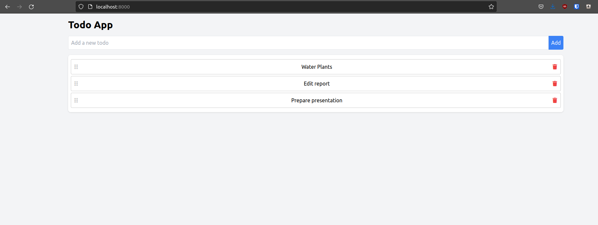
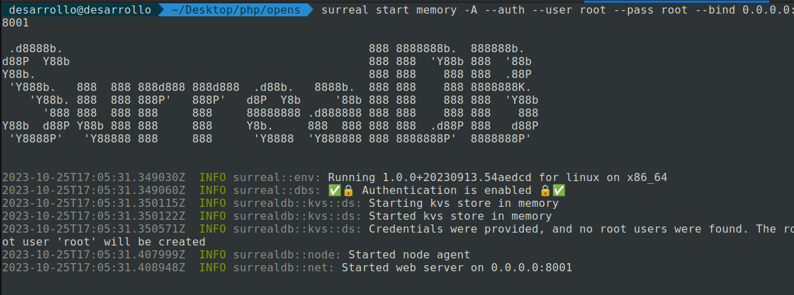
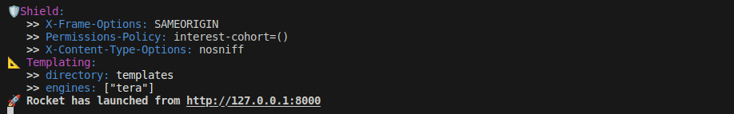

# Rocket App with SurrealDB: TODO App

The project aims to build a basic web application using the Rocket framework, providing the following features:


- [x] Create and manage a list of tasks.
- [ ] Mark tasks as completed.
- [x] Delete tasks.
- [x] Persist data using SurrealDB as the database backend.


   

## Requirements

- [Rust](https://www.rust-lang.org/tools/install)
- [Cargo](https://www.rust-lang.org/tools/install)
- [SurrealDB](https://surrealdb.com/)


## Setup

1. **Clone the Repository**: Clone the repository to your local machine.

2. **Start SurrealDB**:

   ```bash
   surreal start memory -A --auth --user root --pass root --bind 0.0.0.0:8001
   ```

   
3. Start the Rocket web server:


   ```bash
   cargo run
   ```
   


## Usage

- Visit http://localhost:8000 to use the application.
- Add new tasks and mark them as completed.
- Delete tasks as needed.
- The data is persisted using SurrealDB.